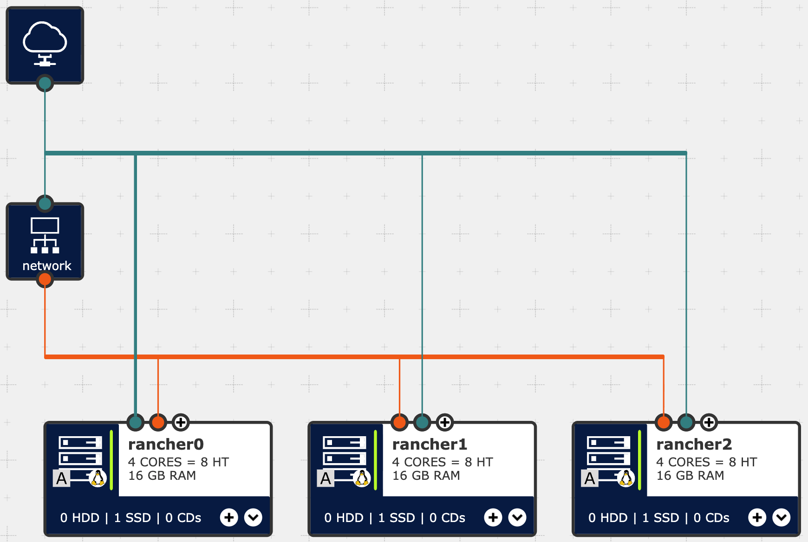

<!--
SPDX-FileCopyrightText: SUSE LLC

SPDX-License-Identifier: Apache-2.0
-->

# Demo: Rancher on IONOS Cloud

Use Terraform or OpenTofu to spin up a high available Rancher Manager
environment on IONOS Cloud for demo and testing purposes.

The project leverages the
[ionoscloud Terraform Provider](https://registry.terraform.io/providers/ionos-cloud/ionoscloud/latest/docs)
and modules from [tf-rancher-up](https://github.com/rancher/tf-rancher-up).

[](https://api.reuse.software/info/github.com/SUSE-Technical-Marketing/demo-rancher-on-ionos-cloud)

## Table of Contents

* [Overview](#overview)
* [Usage](#usage)
* [Known Issues](#known-issues)
* [Documentation](#documentation)
* [Changelog](CHANGELOG.md)
* [Development](#development)
* [License](#license)

## Overview



The high availability deployment aligns with the
[SUSE Rancher Prime - Architecture Recommendations](https://documentation.suse.com/cloudnative/rancher-manager/latest/en/about-rancher/architecture/recommendations.html).

### Rancher Manager Cluster

Rancher Version: 2.13

RKE2 Version: 1.34

1x Network Load Balancer with Public IP

3x Virtual Machine

* Operating System: SLES 15 SP7
* CPU: 4 dedicated cores
* RAM: 16GB
* Storage: 600 GB SSD (Performance: Premium)
   * IOPs Read: 45000, IOPs Write: 30000
   * Read: 600MB/s, Write: 600MB/s
* Network: 1x Public, 1x Private

The assigned resources are based on the
[Hardware requirements - SUSE Rancher Prime on RKE2 Kubernetes](https://documentation.suse.com/cloudnative/rancher-manager/latest/en/installation-and-upgrade/requirements/requirements.html#_suse_rancher_prime_rke2_kubernetes)
for a `Small` managed Environment with up to `150` Cluster and `1500` Nodes.

Those default values can be adjusted via `terraform.tfvars`.

## Usage

Clone the repository including the sub-module `tf-rancher-up`:

```
git clone --recursive https://github.com/SUSE-Technical-Marketing/demo-rancher-on-ionos-cloud.git
```

Required Environment variable:

```
IONOS_TOKEN
```

Learn more about the IONOS Token how to obtain it:
[https://github.com/ionos-cloud/sdk-go#token-authentication](https://github.com/ionos-cloud/sdk-go#token-authentication)

Required `terraform.tfvars` variables:

```
server_ssh_keys          = [] # List of SSH Public Key(s)
scc_registration_code    = "" # SUSE Customer Center registration code for SLES
scc_registration_email   = "" # SUSE Customer Center EMail address for registration
```

Refer to [variables.tf](variables.tf) for a complete overview of all other available,
but optional, variables that you can override.

Then use `terraform plan` and `terraform apply` or `tofu plan` and `tofu apply`
to plan, review and perform the deployment.

Further details about the Terraform / OpenTofu code in the Documentation
section below. Including its [Inputs](#Inputs) and [Outputs](#Outputs).

## Known Issues

### Rancher Helm install race condition

A bug that has to be fixed:
On first deployment the Rancher Helm install might
fail because the cluster isn't ready yet.

```
│ Error: Error checking installed release
│
│   with module.rancher_install.helm_release.rancher,
│   on tf-rancher-up/modules/rancher/main.tf line 115, in resource "helm_release" "rancher":
│  115: resource "helm_release" "rancher" {
│
│ Failed to determine if release exists: Kubernetes cluster unreachable: Get "https://85.215.71.207:6443/version": dial tcp 85.215.71.207:6443: connect: connection refused
╵
```

Workaround: Run `terraform apply` or `tofu apply` again.
At this point, all other resources should be created.
Only `module.rancher_install.helm_release.rancher`
is missing to make the Rancher Manager available.

### Pending upstream Pull Requests

Functionality impacted while waiting on two upstream
Pull Requests to be merged:

* [fix: var.rancher_password is null - Invalid value for "value" parameter: argument must not be null. #217](https://github.com/rancher/tf-rancher-up/pull/217)
* [feat(rancher): add helm options 'atomic' and 'upgrade_install' #218](https://github.com/rancher/tf-rancher-up/pull/218)

Workaround: Update the git submodule to use the fork
[https://github.com/wombelix/fork_rancher_tf-rancher-up](https://github.com/wombelix/fork_rancher_tf-rancher-up)
and checkout the `backports` branch. It contains the
changes from above pull requests.

```
# Enter the submodule directory
cd tf-rancher-up

# Switch the remote URL to the fork
git remote set-url origin https://github.com/wombelix/fork_rancher_tf-rancher-up.git

# Fetch the data from the new remote
git fetch origin

# Checkout the specific commit
git checkout origin/backports

# Return to the project root directory
cd ..
```

## Documentation

<!-- BEGIN_TF_DOCS -->
### Requirements

| Name | Version |
|------|---------|
| <a name="requirement_terraform"></a> [terraform](#requirement\_terraform) | >= 1.10 |
| <a name="requirement_cloudinit"></a> [cloudinit](#requirement\_cloudinit) | 2.3.7 |
| <a name="requirement_ionoscloud"></a> [ionoscloud](#requirement\_ionoscloud) | 6.7.20 |
| <a name="requirement_local"></a> [local](#requirement\_local) | 2.6.1 |
| <a name="requirement_random"></a> [random](#requirement\_random) | 3.7.2 |
| <a name="requirement_ssh"></a> [ssh](#requirement\_ssh) | 2.7.0 |
| <a name="requirement_time"></a> [time](#requirement\_time) | 0.13.1 |

### Providers

| Name | Version |
|------|---------|
| <a name="provider_cloudinit"></a> [cloudinit](#provider\_cloudinit) | 2.3.7 |
| <a name="provider_ionoscloud"></a> [ionoscloud](#provider\_ionoscloud) | 6.7.20 |
| <a name="provider_local"></a> [local](#provider\_local) | 2.6.1 |
| <a name="provider_random"></a> [random](#provider\_random) | 3.7.2 |
| <a name="provider_ssh"></a> [ssh](#provider\_ssh) | 2.7.0 |
| <a name="provider_time"></a> [time](#provider\_time) | 0.13.1 |

### Modules

| Name | Source | Version |
|------|--------|---------|
| <a name="module_rancher_install"></a> [rancher\_install](#module\_rancher\_install) | ./tf-rancher-up/modules/rancher | n/a |
| <a name="module_rke2_additional"></a> [rke2\_additional](#module\_rke2\_additional) | ./tf-rancher-up/modules/distribution/rke2 | n/a |
| <a name="module_rke2_first"></a> [rke2\_first](#module\_rke2\_first) | ./tf-rancher-up/modules/distribution/rke2 | n/a |

### Resources

| Name | Type |
|------|------|
| [ionoscloud_datacenter.vdc](https://registry.terraform.io/providers/ionos-cloud/ionoscloud/6.7.20/docs/resources/datacenter) | resource |
| [ionoscloud_ipblock.ip_lb_rancher](https://registry.terraform.io/providers/ionos-cloud/ionoscloud/6.7.20/docs/resources/ipblock) | resource |
| [ionoscloud_ipblock.ip_server_rancher_first](https://registry.terraform.io/providers/ionos-cloud/ionoscloud/6.7.20/docs/resources/ipblock) | resource |
| [ionoscloud_lan.private](https://registry.terraform.io/providers/ionos-cloud/ionoscloud/6.7.20/docs/resources/lan) | resource |
| [ionoscloud_lan.public](https://registry.terraform.io/providers/ionos-cloud/ionoscloud/6.7.20/docs/resources/lan) | resource |
| [ionoscloud_networkloadbalancer.lb_rancher](https://registry.terraform.io/providers/ionos-cloud/ionoscloud/6.7.20/docs/resources/networkloadbalancer) | resource |
| [ionoscloud_networkloadbalancer_forwardingrule.lb_rancher_rule_http](https://registry.terraform.io/providers/ionos-cloud/ionoscloud/6.7.20/docs/resources/networkloadbalancer_forwardingrule) | resource |
| [ionoscloud_networkloadbalancer_forwardingrule.lb_rancher_rule_https](https://registry.terraform.io/providers/ionos-cloud/ionoscloud/6.7.20/docs/resources/networkloadbalancer_forwardingrule) | resource |
| [ionoscloud_networkloadbalancer_forwardingrule.lb_rancher_rule_k8s](https://registry.terraform.io/providers/ionos-cloud/ionoscloud/6.7.20/docs/resources/networkloadbalancer_forwardingrule) | resource |
| [ionoscloud_networkloadbalancer_forwardingrule.lb_rancher_rule_rke2](https://registry.terraform.io/providers/ionos-cloud/ionoscloud/6.7.20/docs/resources/networkloadbalancer_forwardingrule) | resource |
| [ionoscloud_nic.private_nic](https://registry.terraform.io/providers/ionos-cloud/ionoscloud/6.7.20/docs/resources/nic) | resource |
| [ionoscloud_nic.private_nic_first](https://registry.terraform.io/providers/ionos-cloud/ionoscloud/6.7.20/docs/resources/nic) | resource |
| [ionoscloud_server.server_rancher_additional](https://registry.terraform.io/providers/ionos-cloud/ionoscloud/6.7.20/docs/resources/server) | resource |
| [ionoscloud_server.server_rancher_first](https://registry.terraform.io/providers/ionos-cloud/ionoscloud/6.7.20/docs/resources/server) | resource |
| [local_file.kube_config_yaml](https://registry.terraform.io/providers/hashicorp/local/2.6.1/docs/resources/file) | resource |
| [random_password.sles_image_password](https://registry.terraform.io/providers/hashicorp/random/3.7.2/docs/resources/password) | resource |
| [random_password.token](https://registry.terraform.io/providers/hashicorp/random/3.7.2/docs/resources/password) | resource |
| [ssh_resource.reboot_first_server](https://registry.terraform.io/providers/loafoe/ssh/2.7.0/docs/resources/resource) | resource |
| [ssh_resource.retrieve_kubeconfig](https://registry.terraform.io/providers/loafoe/ssh/2.7.0/docs/resources/resource) | resource |
| [time_sleep.wait_for_lb_propagation](https://registry.terraform.io/providers/hashicorp/time/0.13.1/docs/resources/sleep) | resource |
| [cloudinit_config.server_rancher_additional](https://registry.terraform.io/providers/hashicorp/cloudinit/2.3.7/docs/data-sources/config) | data source |
| [cloudinit_config.server_rancher_first](https://registry.terraform.io/providers/hashicorp/cloudinit/2.3.7/docs/data-sources/config) | data source |
| [ionoscloud_image.sles](https://registry.terraform.io/providers/ionos-cloud/ionoscloud/6.7.20/docs/data-sources/image) | data source |

### Inputs

| Name | Description | Type | Default | Required |
|------|-------------|------|---------|:--------:|
| <a name="input_bootstrap_rancher"></a> [bootstrap\_rancher](#input\_bootstrap\_rancher) | Bootstrap the Rancher installation | `bool` | `true` | no |
| <a name="input_cacerts_path"></a> [cacerts\_path](#input\_cacerts\_path) | Private CA certificate to use for Rancher UI/API connectivity | `string` | `null` | no |
| <a name="input_cert_manager_enable"></a> [cert\_manager\_enable](#input\_cert\_manager\_enable) | Install cert-manager even if not needed for Rancher, useful if migrating to certificates | `bool` | `true` | no |
| <a name="input_cert_manager_helm_atomic"></a> [cert\_manager\_helm\_atomic](#input\_cert\_manager\_helm\_atomic) | Purge cert-manager chart on fail | `bool` | `false` | no |
| <a name="input_cert_manager_helm_repository"></a> [cert\_manager\_helm\_repository](#input\_cert\_manager\_helm\_repository) | Helm repository for Cert Manager chart | `string` | `null` | no |
| <a name="input_cert_manager_helm_repository_password"></a> [cert\_manager\_helm\_repository\_password](#input\_cert\_manager\_helm\_repository\_password) | Private Cert Manager helm repository password | `string` | `null` | no |
| <a name="input_cert_manager_helm_repository_username"></a> [cert\_manager\_helm\_repository\_username](#input\_cert\_manager\_helm\_repository\_username) | Private Cert Manager helm repository username | `string` | `null` | no |
| <a name="input_cert_manager_helm_upgrade_install"></a> [cert\_manager\_helm\_upgrade\_install](#input\_cert\_manager\_helm\_upgrade\_install) | Install the release even if a release not controlled by the provider is present. Equivalent to running 'helm upgrade --install' | `bool` | `true` | no |
| <a name="input_cert_manager_namespace"></a> [cert\_manager\_namespace](#input\_cert\_manager\_namespace) | Namespace to install cert-manager | `string` | `"cert-manager"` | no |
| <a name="input_cert_manager_version"></a> [cert\_manager\_version](#input\_cert\_manager\_version) | Version of cert-manager to install | `string` | `"1.15.5"` | no |
| <a name="input_datacenter_description"></a> [datacenter\_description](#input\_datacenter\_description) | Virtual Data Center description | `string` | `"SUSE Rancher Prime on IONOS Cloud Demo"` | no |
| <a name="input_datacenter_location"></a> [datacenter\_location](#input\_datacenter\_location) | Location / Region of the Virtual Data Center | `string` | `"de/fra"` | no |
| <a name="input_datacenter_name"></a> [datacenter\_name](#input\_datacenter\_name) | Name of the Virtual Data Center | `string` | `"demo-rancher-on-ionos-cloud"` | no |
| <a name="input_helm_timeout"></a> [helm\_timeout](#input\_helm\_timeout) | Specify the timeout value in seconds for helm operation(s) | `number` | `600` | no |
| <a name="input_image_sles"></a> [image\_sles](#input\_image\_sles) | Name of the SLES image to use for virtual machines | `string` | `"sles:15sp7"` | no |
| <a name="input_image_ssh_user"></a> [image\_ssh\_user](#input\_image\_ssh\_user) | Username for SSH access | `string` | `"root"` | no |
| <a name="input_lan_private_name"></a> [lan\_private\_name](#input\_lan\_private\_name) | Name of the private network | `string` | `"private-network"` | no |
| <a name="input_lan_public_name"></a> [lan\_public\_name](#input\_lan\_public\_name) | Name of the public network | `string` | `"public-network"` | no |
| <a name="input_letsencrypt_environment"></a> [letsencrypt\_environment](#input\_letsencrypt\_environment) | Let's Encrypt environment to use staging or production | `string` | `"production"` | no |
| <a name="input_rancher_additional_helm_values"></a> [rancher\_additional\_helm\_values](#input\_rancher\_additional\_helm\_values) | Helm options to provide to the Rancher helm chart | `list(string)` | `[]` | no |
| <a name="input_rancher_antiaffinity"></a> [rancher\_antiaffinity](#input\_rancher\_antiaffinity) | Value for antiAffinity when installing the Rancher helm chart (required/preferred) | `string` | `"required"` | no |
| <a name="input_rancher_bootstrap_password"></a> [rancher\_bootstrap\_password](#input\_rancher\_bootstrap\_password) | Password to use when bootstrapping Rancher (min 12 characters) | `string` | `null` | no |
| <a name="input_rancher_helm_atomic"></a> [rancher\_helm\_atomic](#input\_rancher\_helm\_atomic) | Purge cert-manager chart on fail | `bool` | `false` | no |
| <a name="input_rancher_helm_repository"></a> [rancher\_helm\_repository](#input\_rancher\_helm\_repository) | Helm repository for Rancher chart | `string` | `null` | no |
| <a name="input_rancher_helm_repository_password"></a> [rancher\_helm\_repository\_password](#input\_rancher\_helm\_repository\_password) | Private Rancher helm repository password | `string` | `null` | no |
| <a name="input_rancher_helm_repository_username"></a> [rancher\_helm\_repository\_username](#input\_rancher\_helm\_repository\_username) | Private Rancher helm repository username | `string` | `null` | no |
| <a name="input_rancher_helm_upgrade_install"></a> [rancher\_helm\_upgrade\_install](#input\_rancher\_helm\_upgrade\_install) | Install the release even if a release not controlled by the provider is present. Equivalent to running 'helm upgrade --install' | `bool` | `true` | no |
| <a name="input_rancher_namespace"></a> [rancher\_namespace](#input\_rancher\_namespace) | The Rancher release will be deployed to this namespace | `string` | `"cattle-system"` | no |
| <a name="input_rancher_password"></a> [rancher\_password](#input\_rancher\_password) | Password for the Rancher admin account (min 12 characters) | `string` | `null` | no |
| <a name="input_rancher_replicas"></a> [rancher\_replicas](#input\_rancher\_replicas) | Value for replicas when installing the Rancher helm chart | `number` | `3` | no |
| <a name="input_rancher_version"></a> [rancher\_version](#input\_rancher\_version) | Rancher version to install | `string` | `"2.13.0"` | no |
| <a name="input_registry_password"></a> [registry\_password](#input\_registry\_password) | Private container image registry password | `string` | `null` | no |
| <a name="input_registry_username"></a> [registry\_username](#input\_registry\_username) | Private container image registry username | `string` | `null` | no |
| <a name="input_rke2_config"></a> [rke2\_config](#input\_rke2\_config) | Additional RKE2 configuration to add to the config.yaml file | `string` | `null` | no |
| <a name="input_rke2_version"></a> [rke2\_version](#input\_rke2\_version) | Kubernetes version to use for the RKE2 cluster | `string` | `"v1.34.2+rke2r1"` | no |
| <a name="input_scc_registration_code"></a> [scc\_registration\_code](#input\_scc\_registration\_code) | SLES Registration Code | `string` | n/a | yes |
| <a name="input_scc_registration_email"></a> [scc\_registration\_email](#input\_scc\_registration\_email) | SLES Registration Email | `string` | n/a | yes |
| <a name="input_server_rancher_cpu_cores"></a> [server\_rancher\_cpu\_cores](#input\_server\_rancher\_cpu\_cores) | CPU cores assigned to Rancher Manager servers | `string` | `"4"` | no |
| <a name="input_server_rancher_disk_size"></a> [server\_rancher\_disk\_size](#input\_server\_rancher\_disk\_size) | Disk size assigned to Rancher Manager servers | `string` | `"600"` | no |
| <a name="input_server_rancher_ram"></a> [server\_rancher\_ram](#input\_server\_rancher\_ram) | RAM assigned to Rancher Manager servers | `string` | `"16384"` | no |
| <a name="input_server_ssh_keys"></a> [server\_ssh\_keys](#input\_server\_ssh\_keys) | List of SSH public keys used when a virtual machine is deployed | `list(any)` | `[]` | no |
| <a name="input_tls_crt_path"></a> [tls\_crt\_path](#input\_tls\_crt\_path) | TLS certificate to use for Rancher UI/API connectivity | `string` | `null` | no |
| <a name="input_tls_key_path"></a> [tls\_key\_path](#input\_tls\_key\_path) | TLS key to use for Rancher UI/API connectivity | `string` | `null` | no |
| <a name="input_tls_source"></a> [tls\_source](#input\_tls\_source) | Value for ingress.tls.source when installing the Rancher helm chart. Options: rancher, letsEncrypt, secret | `string` | `"letsEncrypt"` | no |

### Outputs

| Name | Description |
|------|-------------|
| <a name="output_rancher_loadbalancer"></a> [rancher\_loadbalancer](#output\_rancher\_loadbalancer) | Public IP and DNS name of the Load Balancer in front of the Rancher Manager Cluster |
| <a name="output_server_rancher_additional"></a> [server\_rancher\_additional](#output\_server\_rancher\_additional) | Public, Private IP and DNS name of the additional Rancher Nodes |
| <a name="output_server_rancher_first"></a> [server\_rancher\_first](#output\_server\_rancher\_first) | Public, Private IP and DNS name of the first Rancher Node |
| <a name="output_sles_image_password"></a> [sles\_image\_password](#output\_sles\_image\_password) | root User Password for SSH access as backup to ssh keys |
<!-- END_TF_DOCS -->

## Development

[Makefile](Makefile) commands:

* `docs`: Generate tf docs and inject in README.md
* `release`: Bump the version, generate a Changelog, tag and push to remote

## License

Unless otherwise stated: [Apache 2.0](LICENSES/Apache-2.0.txt)

All files contain license information either as
`header comment` or `corresponding .license` file.

Verified with [REUSE](https://reuse.software)
from the [FSFE](https://fsfe.org/).
